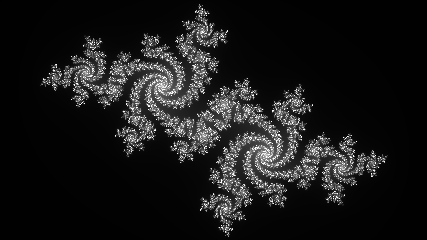

# Fractal Image Generator
This notebook generates [Julia Set](https://en.wikipedia.org/wiki/Julia_set) fractals.

### Libraries Used
* NumPy
* Matplotlib and OpenCV (for viewing and saving image)

### Sample Image

 
<small><i>C = -0.5251993 - i0.5251993</i></small>

